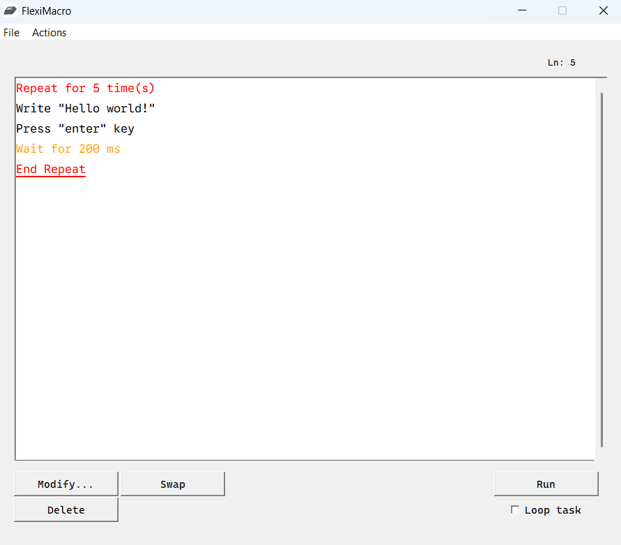
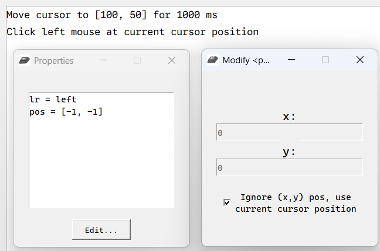
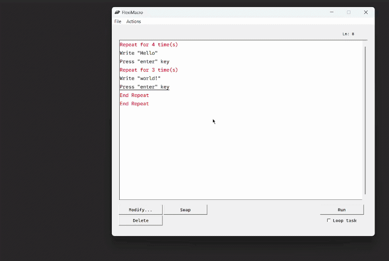

**FlexiMacro** is a user-friendly desktop application designed to automate computer inputs. Users can create their own command sequences from the provided commands and modify their properties to build customized tasks.

## Key Features

- Programmable task automation sequences
- User-friendly command-based interface
- Supports nested repeat systems
- Endless task loop
- Flexible project import and export using JSON

## Built With

- Python
- pyautogui: controls computer input
- tkinter: user interface
- time: task delays
- JSON: data storage and import/export
- keyboard: shortcut detection
- copy: copying data structures

## Future Improvements

- Customizable shortcuts for running and terminating tasks
- More advanced commands and AI integration

## Screenshots

### Main Interface

### Command Configuration

### Task Execution

